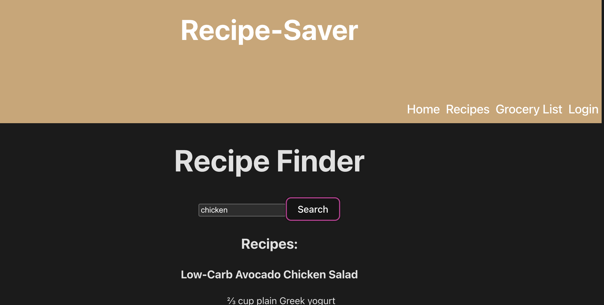

# Recipe-Saver
Our goal with this project is to create a web app that one can use to input the user's pantry supplies and pull recipes from a database and across the web that can be made using what they have on hand.

## Table of Contents
- [Installation](#installation)
- [Usage](#usage)
- [Contribution](#contribution)
- [Technologies](#technologies)
- [Screenshot](#screenshot)
- [Developers](#developers)
- [GitHub Info](#github-info)
- [Questions](#questions)

## Installation

node and npm need to be installed

```cd server and type npm run dev```
```cd ../client npm start```

## Usage
After competing the installion instructions type up in the CLI (terminal), navigate to the code's location using the "cd" cd server and type npm start
cd ../client npm star

## Contribution

Fork repo, make changes, and request a merge.
If you idenitfy any security or performance issues or any major improvements, raise an issue and let the community know.

## Technologies
Application uses a Node.js and Express.js back end and uses both GET and POST routes for retrieving and adding new data.

Application has a folder structure that follows the separation of concerns design principle and uses React for the front end.

Application is backed by a PostgreSQL database with a Sequelize ORM and protects API keys and sensitive information with environment variables.

Application includes user authentication using JWT.

Application uses at least two server-side APIs.

Application deployed at live URL on Render and loads with no errors.

Application uses React for the front end.

Application uses API to communicate and grab recipe and grocery information.

## Screenshot


## References
We had some help with our code by using the following sites and videos
```md
* https://www.youtube.com/watch?v=Y-XW9m8qOis
* https://www.youtube.com/watch?v=K7F2mmQY1UI
* https://api.api-ninjas.com/
* https://tasty.p.rapidapi.com/
* https://getbootstrap.com/docs/4.0/getting-started/introduction/
* https://react.dev/
* stackoverflow
* bootcamp course and materials
```

```

## GitHub info

Rosemarie Lupi: https://github.com/RML-png username: RML-png
Courtney Ponder: https://github.com/CourtneyPonder username: CourtneyPonder
Rosser Williams: https://github.com/rosserw" username: rosserw
Sonu Singh: https://github.com/shoc71" username: shoc71
```

## License
This project is licensed under the MIT License.

## Questions

For any questions or concerns, please email mrdrlogic@gmail.com

Deployed Webpage: https://shoc71.github.io/Recipe-Saver/


